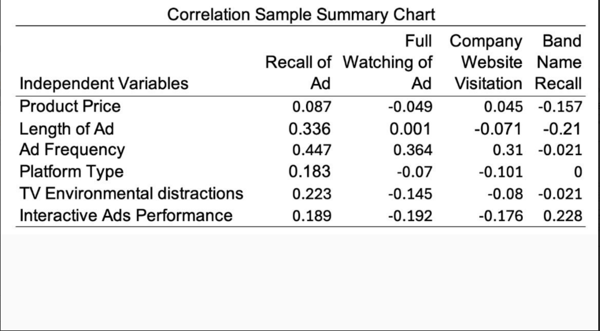
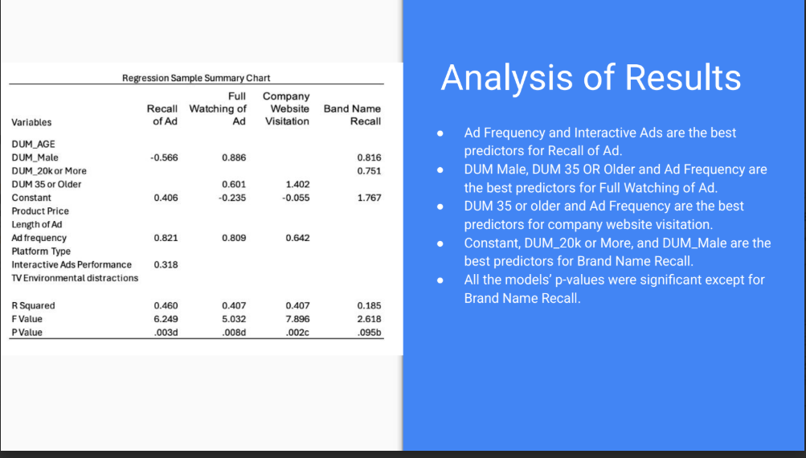
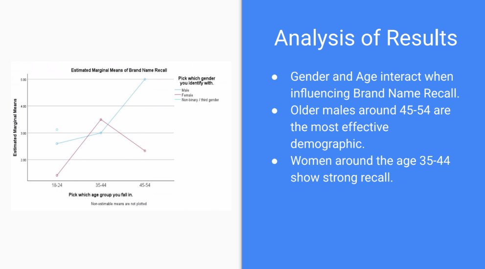
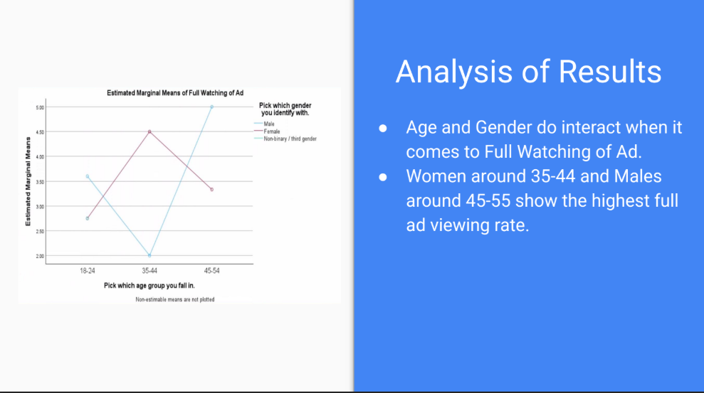

# 📋 Traditional Commercials — Market Research Term Project
> *Survey Design | Qualtrics | SPSS | Statistical Analysis | Data Reporting*

Designed and administered a primary research survey (n=26) examining the effectiveness of traditional commercials on television and streaming platforms. Conducted reliability analysis, GLM, correlation, and regression analysis in SPSS. Identified ad frequency and interactivity as the strongest predictors of ad recall and full ad viewing. Presented findings with actionable strategic recommendations.

---

## 📌 Key Highlights
- Research question: Are commercials on television and streaming platforms still a viable and effective way of marketing?
- Designed and distributed a Qualtrics survey measuring 6 independent variables and 4 dependent variables
- Conducted reliability analysis, GLM, correlation, and regression analysis in SPSS
- Ad Frequency was the strongest predictor across Recall of Ad, Full Watching of Ad, and Company Website Visitation
- Interactive ads positively influenced Brand Name Recall regardless of viewer age
- Older demographics (ages 35-54) showed the highest engagement across most dependent variables
- Platform type (streaming vs. traditional TV) did not significantly affect outcomes
- Concluded that traditional commercials remain a viable marketing tool when targeting the right audience with the right frequency and interactivity

---

## 📄 Full Presentation
[Download Full Presentation (PDF)](Britnee_No_Group___Pres_2___Traditional_Commercial_pptx__1_.pdf)

---

## 🖼️ Project Screenshots

---

## 🔬 Methods Used
- Survey design and administration via Qualtrics
- Reliability analysis (Cronbach's Alpha)
- General Linear Model (GLM)
- Pearson Correlation analysis
- Multiple Regression analysis
- Statistical software: SPSS
